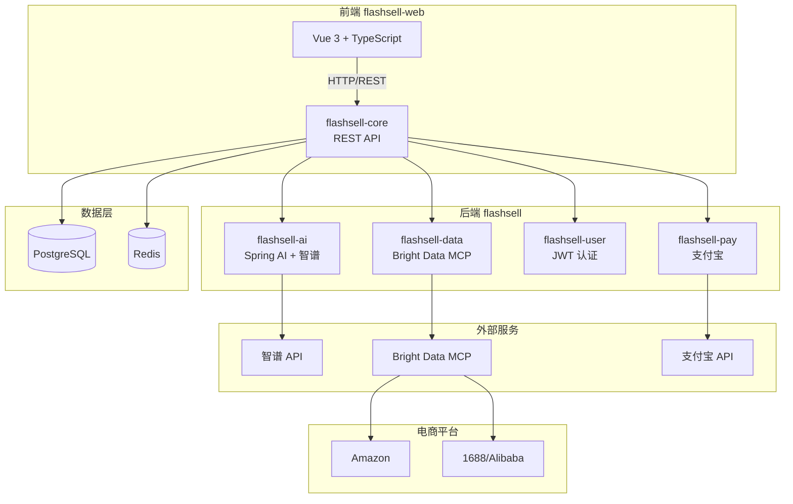

# 设计文档

## 概述

FlashSell 是一款面向跨境电商卖家的 AI 驱动爆品选品工具。本设计文档定义了 MVP 阶段的技术架构和实现方案，采用前后端分离架构，后端使用 Spring Boot 单体分模块设计，前端使用 Vue 3。

### 技术栈

| 层级  | 技术选型                                                       |
| --- | ---------------------------------------------------------- |
| 前端  | Vue 3 + Vite + TypeScript + Tailwind CSS + Pinia + ECharts |
| 后端  | Java 17 + Spring Boot 3.x + Spring AI + MyBatis-Plus       |
| 数据库 | PostgreSQL 15+                                             |
| 缓存  | Redis 7+                                                   |
| AI  | Spring AI + 智谱 GLM-4 API                                   |
| 实时数据 | Bright Data MCP Server（Amazon、1688/Alibaba 数据）          |
| 支付  | 支付宝 SDK                                                    |

## 架构

### 系统架构图



### 后端模块架构

基于 COLA 5.x 架构（参考 github.com/978655242/demo-cola），采用单体分模块设计：

```
flashsell/
├── flashsell-adapter/            # 适配器层 - 处理外部请求
│   ├── web/                      # Web 控制器
│   │   ├── AuthController.java   # 认证 API
│   │   ├── SearchController.java # 搜索 API
│   │   ├── ProductController.java# 产品 API
│   │   ├── FavoriteController.java# 收藏 API
│   │   ├── BoardController.java  # 看板 API
│   │   ├── PaymentController.java# 支付 API
│   │   └── HotProductController.java # 爆品 API
│   └── scheduler/                # 定时任务适配器
│       └── HotProductScheduler.java
│
├── flashsell-app/                # 应用层 - 业务编排
│   ├── service/                  # 应用服务
│   │   ├── AuthAppService.java
│   │   ├── SearchAppService.java
│   │   ├── ProductAppService.java
│   │   ├── FavoriteAppService.java
│   │   ├── BoardAppService.java
│   │   ├── PaymentAppService.java
│   │   └── HotProductAppService.java
│   └── assembler/                # DTO 转换器
│
├── flashsell-client/             # 客户端层 - API 定义
│   ├── api/                      # API 接口定义
│   ├── dto/                      # 数据传输对象
│   │   ├── request/              # 请求 DTO
│   │   └── response/             # 响应 DTO
│   └── query/                    # 查询对象
│
├── flashsell-domain/             # 领域层 - 核心业务逻辑
│   ├── user/                     # 用户领域 (flashsell-user)
│   │   ├── entity/               # 用户实体
│   │   ├── service/              # 用户领域服务
│   │   └── gateway/              # 用户网关接口
│   │
│   ├── product/                  # 产品领域 (flashsell-core)
│   │   ├── entity/               # 产品实体
│   │   ├── service/              # 产品领域服务
│   │   └── gateway/              # 产品网关接口
│   │
│   ├── ai/                       # AI 领域 (flashsell-ai)
│   │   ├── service/              # AI 领域服务
│   │   └── gateway/              # AI 网关接口
│   │
│   ├── data/                     # 数据领域 (flashsell-data)
│   │   ├── service/              # 数据领域服务
│   │   └── gateway/              # 数据网关接口（Bright Data MCP）
│   │
│   └── payment/                  # 支付领域 (flashsell-pay)
│       ├── entity/               # 支付实体
│       ├── service/              # 支付领域服务
│       └── gateway/              # 支付网关接口
│
├── flashsell-infrastructure/     # 基础设施层 - 技术实现
│   ├── gatewayimpl/              # 网关实现
│   │   ├── UserGatewayImpl.java
│   │   ├── ProductGatewayImpl.java
│   │   ├── AiGatewayImpl.java    # Spring AI + 智谱
│   │   ├── BrightDataGatewayImpl.java # Bright Data MCP 实时数据
│   │   └── PaymentGatewayImpl.java # 支付宝 SDK
│   │
│   ├── mapper/                   # MyBatis-Plus Mapper
│   │   ├── UserMapper.java
│   │   ├── ProductMapper.java
│   │   ├── CategoryMapper.java
│   │   ├── FavoriteMapper.java
│   │   ├── BoardMapper.java
│   │   ├── OrderMapper.java
│   │   └── HotProductMapper.java
│   │
│   ├── dataobject/               # 数据库对象
│   ├── convertor/                # DO/Entity 转换器
│   └── config/                   # 配置类
│       ├── RedisConfig.java
│       ├── SecurityConfig.java
│       ├── SpringAiConfig.java
│       └── BrightDataConfig.java # Bright Data MCP 配置
│
└── start/                        # 启动模块
    ├── FlashSellApplication.java
    └── resources/
        ├── application.yml
        └── application-dev.yml
```

### COLA 架构层次说明

| 层级 | 职责 | 依赖方向 |
|-----|------|---------|
| adapter | 处理外部请求（Web、定时任务、消息） | → app |
| app | 业务编排、事务管理、DTO 转换 | → domain, client |
| client | API 接口定义、DTO、Query 对象 | 无依赖 |
| domain | 核心业务逻辑、领域实体、领域服务 | → client |
| infrastructure | 技术实现（数据库、缓存、外部 API） | → domain |
| start | 应用启动、配置 | → 所有模块 |

### 前端架构

```
flashsell-web/
├── src/
│   ├── views/                # 页面组件
│   │   ├── Home.vue          # 首页/仪表盘
│   │   ├── Search.vue        # AI 搜索页
│   │   ├── ProductDetail.vue # 产品详情
│   │   ├── Favorites.vue     # 收藏看板
│   │   ├── HotProducts.vue   # 爆品推荐
│   │   ├── Market.vue        # 市场分析
│   │   ├── Subscription.vue  # 订阅支付
│   │   └── Profile.vue       # 个人中心
│   │
│   ├── components/           # 通用组件
│   │   ├── ProductCard.vue   # 产品卡片
│   │   ├── SearchBar.vue     # 搜索栏
│   │   ├── CategoryFilter.vue# 品类筛选
│   │   ├── PriceChart.vue    # 价格图表
│   │   └── LoadingState.vue  # 加载状态
│   │
│   ├── stores/               # Pinia 状态管理
│   │   ├── user.ts           # 用户状态
│   │   ├── search.ts         # 搜索状态
│   │   └── favorites.ts      # 收藏状态
│   │
│   ├── api/                  # API 调用
│   │   ├── auth.ts           # 认证 API
│   │   ├── search.ts         # 搜索 API
│   │   ├── product.ts        # 产品 API
│   │   └── payment.ts        # 支付 API
│   │
│   ├── router/               # 路由配置
│   └── utils/                # 工具函数
│
├── vite.config.ts
└── tailwind.config.js
```

## 组件与接口

### 核心 API 接口

#### 1. 认证接口 (flashsell-user)

```java
// POST /api/auth/register - 用户注册
RegisterReq {
    phone: String,        // 手机号
    verifyCode: String    // 验证码
}
RegisterRes {
    userId: Long,
    token: String,
    refreshToken: String
}

// POST /api/auth/login - 用户登录
LoginReq {
    phone: String,
    verifyCode: String
}
LoginRes {
    userId: Long,
    token: String,
    refreshToken: String,
    userInfo: UserInfo
}

// POST /api/auth/refresh - 刷新令牌
RefreshReq {
    refreshToken: String
}
RefreshRes {
    token: String,
    refreshToken: String
}

// POST /api/auth/logout - 用户登出
// Header: Authorization: Bearer {token}
```

#### 2. AI 搜索接口 (flashsell-core + flashsell-ai)

```java
// POST /api/search - AI 选品搜索
SearchReq {
    query: String,              // 自然语言查询
    categoryId: Long?,          // 品类 ID（可选）
    priceMin: BigDecimal?,      // 最低价格
    priceMax: BigDecimal?,      // 最高价格
    minRating: Double?,         // 最低评分
    page: Integer,              // 页码
    pageSize: Integer           // 每页数量
}
SearchRes {
    products: List<ProductDTO>,
    total: Long,
    page: Integer,
    hasMore: Boolean,
    aiSummary: String           // AI 搜索摘要
}

// GET /api/categories - 获取支持的品类列表
CategoriesRes {
    groups: List<CategoryGroup>
}
CategoryGroup {
    id: Long,
    name: String,               // 类目组名称
    categories: List<Category>  // 品类列表
}
Category {
    id: Long,
    name: String,
    productCount: Integer
}
```

#### 3. 产品接口 (flashsell-core)

```java
// GET /api/products/{id} - 获取产品详情
ProductDetailRes {
    id: Long,
    title: String,
    image: String,
    currentPrice: BigDecimal,
    priceHistory: List<PricePoint>,
    bsrRank: Integer,
    reviewCount: Integer,
    rating: Double,
    competitionScore: Double,
    aiRecommendation: String,
    category: Category
}

// GET /api/products/{id}/price-history - 获取价格历史
PriceHistoryRes {
    prices: List<PricePoint>
}
PricePoint {
    date: LocalDate,
    price: BigDecimal
}
```

#### 4. 收藏与看板接口 (flashsell-core)

```java
// POST /api/favorites - 添加收藏
AddFavoriteReq {
    productId: Long
}

// DELETE /api/favorites/{productId} - 取消收藏

// GET /api/favorites - 获取收藏列表
FavoritesRes {
    products: List<ProductDTO>,
    total: Long,
    page: Integer
}

// POST /api/boards - 创建看板
CreateBoardReq {
    name: String
}
BoardRes {
    id: Long,
    name: String,
    productCount: Integer
}

// PUT /api/boards/{boardId}/products - 添加产品到看板
AddToBoardReq {
    productIds: List<Long>
}

// GET /api/boards - 获取看板列表
BoardsRes {
    boards: List<BoardRes>,
    maxBoards: Integer          // 用户最大看板数
}
```

#### 5. 支付接口 (flashsell-pay)

```java
// GET /api/subscription/plans - 获取订阅套餐
PlansRes {
    plans: List<SubscriptionPlan>
}
SubscriptionPlan {
    id: Long,
    name: String,               // 基础版/专业版
    monthlyPrice: BigDecimal,
    yearlyPrice: BigDecimal,
    features: List<String>
}

// POST /api/subscription/create - 创建订阅订单
CreateOrderReq {
    planId: Long,
    period: String              // MONTHLY / YEARLY
}
CreateOrderRes {
    orderId: String,
    payUrl: String              // 支付宝支付链接
}

// POST /api/subscription/callback - 支付宝回调（内部）
// GET /api/subscription/status - 获取订阅状态
SubscriptionStatusRes {
    isActive: Boolean,
    plan: String,
    expireDate: LocalDate
}
```

#### 6. 爆品推荐接口 (flashsell-core)

```java
// GET /api/hot-products - 获取爆品推荐列表
HotProductsReq {
    categoryGroupId: Long?,     // 类目组 ID（可选）
    date: LocalDate?            // 日期（可选，默认今天）
}
HotProductsRes {
    date: LocalDate,
    groups: List<HotProductGroup>
}
HotProductGroup {
    categoryGroup: CategoryGroup,
    products: List<HotProductDTO>
}
HotProductDTO {
    product: ProductDTO,
    hotScore: Double,           // 爆品评分
    daysOnList: Integer,        // 上榜天数
    rankChange: Integer         // 排名变化（正数上升，负数下降）
}

// GET /api/hot-products/history - 获取爆品历史趋势
HotProductHistoryRes {
    productId: Long,
    history: List<HotProductHistoryPoint>
}
HotProductHistoryPoint {
    date: LocalDate,
    rank: Integer,
    hotScore: Double
}
```

#### 7. 市场分析接口 (flashsell-core)

```java
// GET /api/market/analysis - 获取市场分析
MarketAnalysisReq {
    categoryId: Long
}
MarketAnalysisRes {
    category: Category,
    salesDistribution: List<SalesDataPoint>,
    competitionScore: Double,
    weekOverWeek: Double,       // 周环比
    monthOverMonth: Double,     // 月环比
    topProducts: List<ProductDTO>
}
```

#### 8. 仪表盘首页接口 (flashsell-adapter)

```java
// GET /api/dashboard/overview - 获取首页数据概览
DashboardOverviewRes {
    todayNewProducts: Integer,          // 今日新品发现数
    potentialHotProducts: Integer,      // 潜力爆品推荐数
    favoriteCount: Integer,             // 收藏产品数
    aiAccuracyRate: Double,             // AI 推荐准确率
    lastUpdateTime: LocalDateTime       // 数据最后更新时间
}

// GET /api/dashboard/hot-recommendations - 获取 AI 爆品推荐（Top 4）
HotRecommendationsRes {
    products: List<HotProductDTO>,      // Top 4 爆品推荐
    updateTime: LocalDateTime
}

// GET /api/dashboard/recent-activity - 获取最近选品记录
RecentActivityRes {
    recentSearches: List<SearchHistoryDTO>,     // 最近搜索（最多10条）
    recentBrowsed: List<ProductDTO>             // 最近浏览（最多8个）
}
SearchHistoryDTO {
    id: Long,
    query: String,
    resultCount: Integer,
    createdAt: LocalDateTime
}

// GET /api/dashboard/trending-categories - 获取热门品类趋势
TrendingCategoriesRes {
    categories: List<TrendingCategoryDTO>
}
TrendingCategoryDTO {
    category: Category,
    trendScore: Double,                 // 趋势评分
    weekOverWeek: Double,               // 周环比增长
    hotProductCount: Integer            // 热门产品数
}

// GET /api/dashboard/hot-keywords - 获取热门搜索关键词
HotKeywordsRes {
    keywords: List<HotKeywordDTO>
}
HotKeywordDTO {
    keyword: String,
    searchCount: Integer,
    trend: String                       // UP, DOWN, STABLE
}
```

#### 9. 搜索历史接口 (flashsell-adapter)

```java
// GET /api/search/history - 获取搜索历史
SearchHistoryReq {
    page: Integer,
    pageSize: Integer
}
SearchHistoryRes {
    histories: List<SearchHistoryDTO>,
    total: Long,
    page: Integer
}

// DELETE /api/search/history/{id} - 删除单条搜索历史

// DELETE /api/search/history - 清空搜索历史

// GET /api/browse/history - 获取浏览历史
BrowseHistoryReq {
    page: Integer,
    pageSize: Integer
}
BrowseHistoryRes {
    products: List<BrowseHistoryDTO>,
    total: Long,
    page: Integer
}
BrowseHistoryDTO {
    product: ProductDTO,
    browsedAt: LocalDateTime
}

// DELETE /api/browse/history/{productId} - 删除单条浏览历史

// DELETE /api/browse/history - 清空浏览历史
```

#### 10. 个人中心接口 (flashsell-adapter)

```java
// GET /api/user/profile - 获取用户资料
UserProfileRes {
    userId: Long,
    nickname: String,
    avatar: String,
    email: String,
    phone: String,
    subscriptionLevel: String,      // FREE, BASIC, PRO
    subscriptionExpireDate: LocalDate,
    lastLoginTime: LocalDateTime,
    createdAt: LocalDateTime
}

// PUT /api/user/profile - 更新用户资料
UpdateProfileReq {
    nickname: String?,
    avatar: String?
}

// GET /api/user/usage - 获取使用情况统计
UsageStatsRes {
    month: String,                  // 2025-01
    searchCount: Integer,           // 已使用搜索次数
    searchLimit: Integer,           // 搜索次数限额（-1表示无限）
    favoriteCount: Integer,         // 收藏产品数
    favoriteLimit: Integer,         // 收藏限额
    exportCount: Integer,           // 导出报告数
    exportLimit: Integer            // 导出限额
}

// GET /api/user/settings - 获取用户设置
UserSettingsRes {
    notificationEnabled: Boolean,   // 消息通知
    emailSubscribed: Boolean,       // 邮件订阅
    twoFactorEnabled: Boolean,      // 两步验证
    phoneVerified: Boolean          // 手机已绑定
}

// PUT /api/user/settings - 更新用户设置
UpdateSettingsReq {
    notificationEnabled: Boolean?,
    emailSubscribed: Boolean?
}

// POST /api/user/password - 修改密码
ChangePasswordReq {
    oldPassword: String,
    newPassword: String
}

// POST /api/user/phone/bindCode - 发送绑定手机验证码
SendBindCodeReq {
    phone: String
}

// POST /api/user/phone/bind - 绑定手机
BindPhoneReq {
    phone: String,
    verifyCode: String
}

// POST /api/user/2fa/enable - 开启两步验证
Enable2FARes {
    secret: String,                 // TOTP 密钥
    qrCodeUrl: String               // 二维码 URL
}

// POST /api/user/2fa/verify - 验证两步验证
Verify2FAReq {
    code: String                    // 6位验证码
}

// DELETE /api/user/account - 注销账户
DeleteAccountReq {
    password: String,
    reason: String?
}

// GET /api/user/invite - 获取邀请信息
InviteInfoRes {
    inviteCode: String,
    inviteLink: String,
    invitedCount: Integer,
    rewardDays: Integer             // 获得的免费天数
}

// POST /api/user/export - 导出数据报告
ExportReportReq {
    type: String                    // FAVORITES, SEARCH_HISTORY, ALL
}
ExportReportRes {
    downloadUrl: String,
    expireTime: LocalDateTime
}
```

## 数据模型

### PostgreSQL 数据库设计

```sql
-- =====================================================
-- 用户相关表
-- =====================================================

-- 用户表
CREATE TABLE users (
    id BIGSERIAL PRIMARY KEY,
    phone VARCHAR(20) UNIQUE NOT NULL,
    password_hash VARCHAR(255),
    nickname VARCHAR(100),
    avatar_url VARCHAR(500),
    email VARCHAR(255),
    subscription_level VARCHAR(20) DEFAULT 'FREE',
    subscription_expire_date DATE,
    notification_enabled BOOLEAN DEFAULT TRUE,
    email_subscribed BOOLEAN DEFAULT FALSE,
    two_factor_enabled BOOLEAN DEFAULT FALSE,
    two_factor_secret VARCHAR(100),
    phone_verified BOOLEAN DEFAULT FALSE,
    last_login_time TIMESTAMP,
    created_at TIMESTAMP DEFAULT CURRENT_TIMESTAMP,
    updated_at TIMESTAMP DEFAULT CURRENT_TIMESTAMP,
    deleted_at TIMESTAMP
);

COMMENT ON TABLE users IS '用户表';
COMMENT ON COLUMN users.id IS '用户ID，主键自增';
COMMENT ON COLUMN users.phone IS '手机号，唯一';
COMMENT ON COLUMN users.password_hash IS '密码哈希值（BCrypt加密）';
COMMENT ON COLUMN users.nickname IS '用户昵称';
COMMENT ON COLUMN users.avatar_url IS '头像URL';
COMMENT ON COLUMN users.email IS '邮箱地址';
COMMENT ON COLUMN users.subscription_level IS '订阅等级：FREE-免费版, BASIC-基础版, PRO-专业版';
COMMENT ON COLUMN users.subscription_expire_date IS '订阅到期日期';
COMMENT ON COLUMN users.notification_enabled IS '是否开启消息通知';
COMMENT ON COLUMN users.email_subscribed IS '是否订阅邮件';
COMMENT ON COLUMN users.two_factor_enabled IS '是否开启两步验证';
COMMENT ON COLUMN users.two_factor_secret IS 'TOTP两步验证密钥';
COMMENT ON COLUMN users.phone_verified IS '手机号是否已验证';
COMMENT ON COLUMN users.last_login_time IS '最后登录时间';
COMMENT ON COLUMN users.created_at IS '创建时间';
COMMENT ON COLUMN users.updated_at IS '更新时间';
COMMENT ON COLUMN users.deleted_at IS '删除时间（软删除）';

-- 用户邀请表
CREATE TABLE user_invites (
    id BIGSERIAL PRIMARY KEY,
    user_id BIGINT REFERENCES users(id),
    invite_code VARCHAR(20) UNIQUE NOT NULL,
    invited_count INTEGER DEFAULT 0,
    reward_days INTEGER DEFAULT 0,
    created_at TIMESTAMP DEFAULT CURRENT_TIMESTAMP
);

COMMENT ON TABLE user_invites IS '用户邀请表';
COMMENT ON COLUMN user_invites.id IS '主键ID';
COMMENT ON COLUMN user_invites.user_id IS '用户ID，关联users表';
COMMENT ON COLUMN user_invites.invite_code IS '邀请码，唯一';
COMMENT ON COLUMN user_invites.invited_count IS '已邀请人数';
COMMENT ON COLUMN user_invites.reward_days IS '获得的奖励天数';
COMMENT ON COLUMN user_invites.created_at IS '创建时间';

-- 邀请记录表
CREATE TABLE invite_records (
    id BIGSERIAL PRIMARY KEY,
    inviter_id BIGINT REFERENCES users(id),
    invitee_id BIGINT REFERENCES users(id),
    reward_days INTEGER DEFAULT 7,
    created_at TIMESTAMP DEFAULT CURRENT_TIMESTAMP
);

COMMENT ON TABLE invite_records IS '邀请记录表';
COMMENT ON COLUMN invite_records.id IS '主键ID';
COMMENT ON COLUMN invite_records.inviter_id IS '邀请人ID';
COMMENT ON COLUMN invite_records.invitee_id IS '被邀请人ID';
COMMENT ON COLUMN invite_records.reward_days IS '奖励天数';
COMMENT ON COLUMN invite_records.created_at IS '创建时间';

-- 用户使用统计表（按月）
CREATE TABLE user_usage_stats (
    id BIGSERIAL PRIMARY KEY,
    user_id BIGINT REFERENCES users(id),
    month VARCHAR(7) NOT NULL,
    search_count INTEGER DEFAULT 0,
    export_count INTEGER DEFAULT 0,
    created_at TIMESTAMP DEFAULT CURRENT_TIMESTAMP,
    updated_at TIMESTAMP DEFAULT CURRENT_TIMESTAMP,
    UNIQUE(user_id, month)
);

COMMENT ON TABLE user_usage_stats IS '用户使用统计表（按月统计）';
COMMENT ON COLUMN user_usage_stats.id IS '主键ID';
COMMENT ON COLUMN user_usage_stats.user_id IS '用户ID';
COMMENT ON COLUMN user_usage_stats.month IS '统计月份，格式：YYYY-MM';
COMMENT ON COLUMN user_usage_stats.search_count IS '搜索次数';
COMMENT ON COLUMN user_usage_stats.export_count IS '导出次数';
COMMENT ON COLUMN user_usage_stats.created_at IS '创建时间';
COMMENT ON COLUMN user_usage_stats.updated_at IS '更新时间';

-- =====================================================
-- 品类相关表
-- =====================================================

-- 品类组表
CREATE TABLE category_groups (
    id BIGSERIAL PRIMARY KEY,
    name VARCHAR(100) NOT NULL,
    sort_order INTEGER DEFAULT 0,
    created_at TIMESTAMP DEFAULT CURRENT_TIMESTAMP
);

COMMENT ON TABLE category_groups IS '品类组表（四大类目）';
COMMENT ON COLUMN category_groups.id IS '主键ID';
COMMENT ON COLUMN category_groups.name IS '类目组名称：工业用品、节日装饰、家居生活与百货、数码配件与小家电';
COMMENT ON COLUMN category_groups.sort_order IS '排序序号';
COMMENT ON COLUMN category_groups.created_at IS '创建时间';

-- 品类表
CREATE TABLE categories (
    id BIGSERIAL PRIMARY KEY,
    group_id BIGINT REFERENCES category_groups(id),
    name VARCHAR(100) NOT NULL,
    amazon_category_id VARCHAR(50),
    product_count INTEGER DEFAULT 0,
    created_at TIMESTAMP DEFAULT CURRENT_TIMESTAMP
);

COMMENT ON TABLE categories IS '品类表（45个固定品类）';
COMMENT ON COLUMN categories.id IS '主键ID';
COMMENT ON COLUMN categories.group_id IS '所属类目组ID';
COMMENT ON COLUMN categories.name IS '品类名称';
COMMENT ON COLUMN categories.amazon_category_id IS 'Amazon品类ID';
COMMENT ON COLUMN categories.product_count IS '品类下产品数量';
COMMENT ON COLUMN categories.created_at IS '创建时间';

-- =====================================================
-- 产品相关表
-- =====================================================

-- 产品表
CREATE TABLE products (
    id BIGSERIAL PRIMARY KEY,
    asin VARCHAR(20) UNIQUE,
    title VARCHAR(500) NOT NULL,
    image_url VARCHAR(500),
    current_price DECIMAL(10,2),
    bsr_rank INTEGER,
    review_count INTEGER DEFAULT 0,
    rating DECIMAL(2,1),
    category_id BIGINT REFERENCES categories(id),
    competition_score DECIMAL(3,2),
    ai_recommendation TEXT,
    last_updated TIMESTAMP,
    created_at TIMESTAMP DEFAULT CURRENT_TIMESTAMP
);

COMMENT ON TABLE products IS '产品表';
COMMENT ON COLUMN products.id IS '主键ID';
COMMENT ON COLUMN products.asin IS 'Amazon标准识别号，唯一';
COMMENT ON COLUMN products.title IS '产品标题';
COMMENT ON COLUMN products.image_url IS '产品图片URL';
COMMENT ON COLUMN products.current_price IS '当前价格（美元）';
COMMENT ON COLUMN products.bsr_rank IS 'BSR排名（Best Sellers Rank）';
COMMENT ON COLUMN products.review_count IS '评论数量';
COMMENT ON COLUMN products.rating IS '评分（1.0-5.0）';
COMMENT ON COLUMN products.category_id IS '所属品类ID';
COMMENT ON COLUMN products.competition_score IS '竞争评分（0.00-1.00）';
COMMENT ON COLUMN products.ai_recommendation IS 'AI推荐理由';
COMMENT ON COLUMN products.last_updated IS '数据最后更新时间';
COMMENT ON COLUMN products.created_at IS '创建时间';

-- 产品价格历史表
CREATE TABLE product_price_history (
    id BIGSERIAL PRIMARY KEY,
    product_id BIGINT REFERENCES products(id),
    price DECIMAL(10,2) NOT NULL,
    recorded_date DATE NOT NULL,
    created_at TIMESTAMP DEFAULT CURRENT_TIMESTAMP,
    UNIQUE(product_id, recorded_date)
);

COMMENT ON TABLE product_price_history IS '产品价格历史表';
COMMENT ON COLUMN product_price_history.id IS '主键ID';
COMMENT ON COLUMN product_price_history.product_id IS '产品ID';
COMMENT ON COLUMN product_price_history.price IS '价格（美元）';
COMMENT ON COLUMN product_price_history.recorded_date IS '记录日期';
COMMENT ON COLUMN product_price_history.created_at IS '创建时间';

-- =====================================================
-- 收藏与看板相关表
-- =====================================================

-- 用户收藏表
CREATE TABLE user_favorites (
    id BIGSERIAL PRIMARY KEY,
    user_id BIGINT REFERENCES users(id),
    product_id BIGINT REFERENCES products(id),
    created_at TIMESTAMP DEFAULT CURRENT_TIMESTAMP,
    UNIQUE(user_id, product_id)
);

COMMENT ON TABLE user_favorites IS '用户收藏表';
COMMENT ON COLUMN user_favorites.id IS '主键ID';
COMMENT ON COLUMN user_favorites.user_id IS '用户ID';
COMMENT ON COLUMN user_favorites.product_id IS '产品ID';
COMMENT ON COLUMN user_favorites.created_at IS '收藏时间';

-- 看板表
CREATE TABLE boards (
    id BIGSERIAL PRIMARY KEY,
    user_id BIGINT REFERENCES users(id),
    name VARCHAR(100) NOT NULL,
    created_at TIMESTAMP DEFAULT CURRENT_TIMESTAMP,
    deleted_at TIMESTAMP
);

COMMENT ON TABLE boards IS '看板表';
COMMENT ON COLUMN boards.id IS '主键ID';
COMMENT ON COLUMN boards.user_id IS '用户ID';
COMMENT ON COLUMN boards.name IS '看板名称';
COMMENT ON COLUMN boards.created_at IS '创建时间';
COMMENT ON COLUMN boards.deleted_at IS '删除时间（软删除）';

-- 看板产品关联表
CREATE TABLE board_products (
    id BIGSERIAL PRIMARY KEY,
    board_id BIGINT REFERENCES boards(id),
    product_id BIGINT REFERENCES products(id),
    added_at TIMESTAMP DEFAULT CURRENT_TIMESTAMP,
    UNIQUE(board_id, product_id)
);

COMMENT ON TABLE board_products IS '看板产品关联表';
COMMENT ON COLUMN board_products.id IS '主键ID';
COMMENT ON COLUMN board_products.board_id IS '看板ID';
COMMENT ON COLUMN board_products.product_id IS '产品ID';
COMMENT ON COLUMN board_products.added_at IS '添加时间';

-- =====================================================
-- 订阅与支付相关表
-- =====================================================

-- 订阅订单表
CREATE TABLE subscription_orders (
    id BIGSERIAL PRIMARY KEY,
    user_id BIGINT REFERENCES users(id),
    order_no VARCHAR(50) UNIQUE NOT NULL,
    plan_id BIGINT NOT NULL,
    period VARCHAR(20) NOT NULL,
    amount DECIMAL(10,2) NOT NULL,
    status VARCHAR(20) DEFAULT 'PENDING',
    alipay_trade_no VARCHAR(100),
    paid_at TIMESTAMP,
    created_at TIMESTAMP DEFAULT CURRENT_TIMESTAMP
);

COMMENT ON TABLE subscription_orders IS '订阅订单表';
COMMENT ON COLUMN subscription_orders.id IS '主键ID';
COMMENT ON COLUMN subscription_orders.user_id IS '用户ID';
COMMENT ON COLUMN subscription_orders.order_no IS '订单号，唯一';
COMMENT ON COLUMN subscription_orders.plan_id IS '套餐ID';
COMMENT ON COLUMN subscription_orders.period IS '订阅周期：MONTHLY-月付, YEARLY-年付';
COMMENT ON COLUMN subscription_orders.amount IS '订单金额（人民币）';
COMMENT ON COLUMN subscription_orders.status IS '订单状态：PENDING-待支付, PAID-已支付, FAILED-失败, CANCELLED-已取消';
COMMENT ON COLUMN subscription_orders.alipay_trade_no IS '支付宝交易号';
COMMENT ON COLUMN subscription_orders.paid_at IS '支付时间';
COMMENT ON COLUMN subscription_orders.created_at IS '创建时间';

-- =====================================================
-- 爆品推荐相关表
-- =====================================================

-- 爆品推荐表
CREATE TABLE hot_products (
    id BIGSERIAL PRIMARY KEY,
    product_id BIGINT REFERENCES products(id),
    category_id BIGINT REFERENCES categories(id),
    hot_score DECIMAL(5,2) NOT NULL,
    rank_in_category INTEGER NOT NULL,
    recommend_date DATE NOT NULL,
    created_at TIMESTAMP DEFAULT CURRENT_TIMESTAMP,
    UNIQUE(product_id, recommend_date)
);

COMMENT ON TABLE hot_products IS '爆品推荐表（每日更新）';
COMMENT ON COLUMN hot_products.id IS '主键ID';
COMMENT ON COLUMN hot_products.product_id IS '产品ID';
COMMENT ON COLUMN hot_products.category_id IS '品类ID';
COMMENT ON COLUMN hot_products.hot_score IS '爆品评分（0-100）';
COMMENT ON COLUMN hot_products.rank_in_category IS '品类内排名';
COMMENT ON COLUMN hot_products.recommend_date IS '推荐日期';
COMMENT ON COLUMN hot_products.created_at IS '创建时间';

-- =====================================================
-- 历史记录相关表
-- =====================================================

-- 搜索历史表
CREATE TABLE search_history (
    id BIGSERIAL PRIMARY KEY,
    user_id BIGINT REFERENCES users(id),
    query TEXT NOT NULL,
    result_count INTEGER,
    created_at TIMESTAMP DEFAULT CURRENT_TIMESTAMP
);

COMMENT ON TABLE search_history IS '搜索历史表';
COMMENT ON COLUMN search_history.id IS '主键ID';
COMMENT ON COLUMN search_history.user_id IS '用户ID';
COMMENT ON COLUMN search_history.query IS '搜索查询内容';
COMMENT ON COLUMN search_history.result_count IS '搜索结果数量';
COMMENT ON COLUMN search_history.created_at IS '搜索时间';

-- 浏览历史表
CREATE TABLE browse_history (
    id BIGSERIAL PRIMARY KEY,
    user_id BIGINT REFERENCES users(id),
    product_id BIGINT REFERENCES products(id),
    browsed_at TIMESTAMP DEFAULT CURRENT_TIMESTAMP,
    UNIQUE(user_id, product_id)
);

COMMENT ON TABLE browse_history IS '浏览历史表';
COMMENT ON COLUMN browse_history.id IS '主键ID';
COMMENT ON COLUMN browse_history.user_id IS '用户ID';
COMMENT ON COLUMN browse_history.product_id IS '产品ID';
COMMENT ON COLUMN browse_history.browsed_at IS '浏览时间（重复浏览更新此时间）';

-- 热门关键词统计表
CREATE TABLE hot_keywords (
    id BIGSERIAL PRIMARY KEY,
    keyword VARCHAR(200) NOT NULL,
    search_count INTEGER DEFAULT 0,
    trend VARCHAR(20) DEFAULT 'STABLE',
    stat_date DATE NOT NULL,
    created_at TIMESTAMP DEFAULT CURRENT_TIMESTAMP,
    UNIQUE(keyword, stat_date)
);

COMMENT ON TABLE hot_keywords IS '热门关键词统计表（每日统计）';
COMMENT ON COLUMN hot_keywords.id IS '主键ID';
COMMENT ON COLUMN hot_keywords.keyword IS '关键词';
COMMENT ON COLUMN hot_keywords.search_count IS '搜索次数';
COMMENT ON COLUMN hot_keywords.trend IS '趋势：UP-上升, DOWN-下降, STABLE-稳定';
COMMENT ON COLUMN hot_keywords.stat_date IS '统计日期';
COMMENT ON COLUMN hot_keywords.created_at IS '创建时间';

-- =====================================================
-- 索引
-- =====================================================
CREATE INDEX idx_products_category ON products(category_id);
CREATE INDEX idx_products_bsr ON products(bsr_rank);
CREATE INDEX idx_user_favorites_user ON user_favorites(user_id);
CREATE INDEX idx_boards_user ON boards(user_id);
CREATE INDEX idx_hot_products_date ON hot_products(recommend_date);
CREATE INDEX idx_hot_products_category_date ON hot_products(category_id, recommend_date);
CREATE INDEX idx_search_history_user ON search_history(user_id);
CREATE INDEX idx_search_history_created ON search_history(user_id, created_at DESC);
CREATE INDEX idx_browse_history_user ON browse_history(user_id);
CREATE INDEX idx_browse_history_browsed ON browse_history(user_id, browsed_at DESC);
CREATE INDEX idx_hot_keywords_date ON hot_keywords(stat_date);
```

### Redis 缓存设计

```
# 用户会话
session:{userId} -> {token, refreshToken, expireTime}
TTL: 7 days (可配置)

# AI 搜索结果缓存
search:{queryHash} -> {SearchResponse JSON}
TTL: 15 minutes

# 产品详情缓存
product:{productId} -> {ProductDetailResponse JSON}
TTL: 1 hour

# 爆品推荐缓存
hot_products:{date}:{categoryGroupId} -> {HotProductsResponse JSON}
TTL: 24 hours

# 品类列表缓存
categories:all -> {CategoriesResponse JSON}
TTL: 1 hour

# 用户订阅状态缓存
subscription:{userId} -> {SubscriptionStatusResponse JSON}
TTL: 1 hour

# 仪表盘数据概览缓存
dashboard:overview -> {DashboardOverviewResponse JSON}
TTL: 5 minutes

# 热门关键词缓存
dashboard:hot_keywords -> {HotKeywordsResponse JSON}
TTL: 30 minutes

# 热门品类趋势缓存
dashboard:trending_categories -> {TrendingCategoriesResponse JSON}
TTL: 1 hour

# 用户最近活动缓存
user:recent_activity:{userId} -> {RecentActivityResponse JSON}
TTL: 5 minutes
```

## Spring AI 集成设计

### 智谱 API 配置

```yaml
# application.yml
spring:
  ai:
    zhipu:
      api-key: ${ZHIPU_API_KEY}
      model: glm-4.7
      temperature: 0.7
      max-tokens: 2000
```

## Bright Data MCP 集成设计

### 概述

FlashSell 使用 Bright Data MCP Server 作为实时电商数据源，支持从 Amazon、1688/Alibaba 等平台获取最新商品数据。

### 配置

```yaml
# application.yml
brightdata:
  api-token: ${BRIGHTDATA_API_TOKEN}
  base-url: https://mcp.brightdata.com
  mode: pro  # rapid(免费) 或 pro(付费)
  timeout: 30000  # 请求超时时间（毫秒）
  retry:
    max-attempts: 3
    delay: 1000
  rate-limit:
    requests-per-minute: 100
```

### 支持的数据工具

| 工具名称 | 平台 | 功能 | 模式 |
|---------|------|------|------|
| `web_data_amazon_product` | Amazon | 商品详情（价格、评分、评论数、BSR） | Pro |
| `web_data_amazon_product_reviews` | Amazon | 商品评论数据 | Pro |
| `web_data_amazon_product_search` | Amazon | 关键词搜索结果 | Pro |
| `scrape_as_markdown` | 任意网站 | 通用爬取（用于 1688） | Rapid/Pro |
| `scrape_batch` | 任意网站 | 批量爬取（最多 10 个 URL） | Pro |

### 数据网关接口

```java
// flashsell-domain/data/gateway/BrightDataGateway.java
public interface BrightDataGateway {
    
    /**
     * 搜索 Amazon 商品
     * @param keyword 搜索关键词
     * @param domain Amazon 域名（如 amazon.com）
     * @return 商品列表
     */
    List<AmazonProduct> searchAmazonProducts(String keyword, String domain);
    
    /**
     * 获取 Amazon 商品详情
     * @param productUrl 商品 URL（包含 /dp/）
     * @return 商品详情
     */
    AmazonProduct getAmazonProductDetail(String productUrl);
    
    /**
     * 获取 Amazon 商品评论
     * @param productUrl 商品 URL
     * @return 评论列表
     */
    List<AmazonReview> getAmazonProductReviews(String productUrl);
    
    /**
     * 爬取 1688 商品数据
     * @param keyword 搜索关键词
     * @return 商品列表（需 AI 解析）
     */
    List<AlibabaProduct> scrape1688Products(String keyword);
    
    /**
     * 批量获取商品数据
     * @param urls 商品 URL 列表（最多 10 个）
     * @return 商品详情列表
     */
    List<AmazonProduct> batchGetProducts(List<String> urls);
}
```

### 网关实现

```java
// flashsell-infrastructure/gatewayimpl/BrightDataGatewayImpl.java
@Repository
@Slf4j
public class BrightDataGatewayImpl implements BrightDataGateway {
    
    private final RestTemplate restTemplate;
    private final BrightDataConfig config;
    private final AiGateway aiGateway;  // 用于解析 1688 数据
    private final RedisTemplate<String, Object> redisTemplate;
    
    @Override
    public List<AmazonProduct> searchAmazonProducts(String keyword, String domain) {
        String cacheKey = "brightdata:amazon:search:" + keyword.hashCode();
        
        // 检查缓存
        List<AmazonProduct> cached = (List<AmazonProduct>) redisTemplate.opsForValue().get(cacheKey);
        if (cached != null) {
            return cached;
        }
        
        // 调用 Bright Data API
        String url = config.getBaseUrl() + "/web_data_amazon_product_search";
        
        Map<String, Object> request = Map.of(
            "keyword", keyword,
            "domain", domain
        );
        
        try {
            BrightDataResponse response = restTemplate.postForObject(
                url, 
                createRequest(request), 
                BrightDataResponse.class
            );
            
            List<AmazonProduct> products = parseAmazonSearchResults(response);
            
            // 缓存结果（15分钟）
            redisTemplate.opsForValue().set(cacheKey, products, Duration.ofMinutes(15));
            
            // 记录请求日志
            logApiRequest("amazon_product_search", keyword);
            
            return products;
        } catch (Exception e) {
            log.error("Bright Data API 调用失败: {}", e.getMessage());
            throw new BrightDataException("获取 Amazon 数据失败", e);
        }
    }
    
    @Override
    public AmazonProduct getAmazonProductDetail(String productUrl) {
        String asin = extractAsin(productUrl);
        String cacheKey = "brightdata:amazon:product:" + asin;
        
        // 检查缓存
        AmazonProduct cached = (AmazonProduct) redisTemplate.opsForValue().get(cacheKey);
        if (cached != null) {
            return cached;
        }
        
        String url = config.getBaseUrl() + "/web_data_amazon_product";
        
        Map<String, Object> request = Map.of("url", productUrl);
        
        BrightDataResponse response = restTemplate.postForObject(
            url, 
            createRequest(request), 
            BrightDataResponse.class
        );
        
        AmazonProduct product = parseAmazonProduct(response);
        
        // 缓存结果（1小时）
        redisTemplate.opsForValue().set(cacheKey, product, Duration.ofHours(1));
        
        logApiRequest("amazon_product_detail", asin);
        
        return product;
    }
    
    @Override
    public List<AlibabaProduct> scrape1688Products(String keyword) {
        String searchUrl = "https://s.1688.com/selloffer/offer_search.htm?keywords=" 
            + URLEncoder.encode(keyword, StandardCharsets.UTF_8);
        
        String url = config.getBaseUrl() + "/scrape_as_markdown";
        
        Map<String, Object> request = Map.of("url", searchUrl);
        
        BrightDataResponse response = restTemplate.postForObject(
            url, 
            createRequest(request), 
            BrightDataResponse.class
        );
        
        String markdown = response.getContent();
        
        // 使用 AI 解析 Markdown 提取商品信息
        List<AlibabaProduct> products = aiGateway.parseProductsFromMarkdown(markdown);
        
        logApiRequest("1688_scrape", keyword);
        
        return products;
    }
    
    @Override
    public List<AmazonProduct> batchGetProducts(List<String> urls) {
        if (urls.size() > 10) {
            throw new IllegalArgumentException("批量请求最多支持 10 个 URL");
        }
        
        String url = config.getBaseUrl() + "/scrape_batch";
        
        Map<String, Object> request = Map.of("urls", urls);
        
        BrightDataResponse response = restTemplate.postForObject(
            url, 
            createRequest(request), 
            BrightDataResponse.class
        );
        
        logApiRequest("batch_scrape", String.valueOf(urls.size()));
        
        return parseAmazonProducts(response);
    }
    
    private HttpEntity<Map<String, Object>> createRequest(Map<String, Object> body) {
        HttpHeaders headers = new HttpHeaders();
        headers.setContentType(MediaType.APPLICATION_JSON);
        headers.set("Authorization", "Bearer " + config.getApiToken());
        return new HttpEntity<>(body, headers);
    }
    
    private void logApiRequest(String tool, String params) {
        log.info("Bright Data API 调用: tool={}, params={}", tool, params);
        // 可以记录到数据库用于成本监控
    }
}
```

### Amazon 商品数据模型

```java
// flashsell-domain/data/entity/AmazonProduct.java
@Data
public class AmazonProduct {
    private String asin;                    // Amazon 标准识别号
    private String title;                   // 商品标题
    private String imageUrl;                // 商品图片
    private BigDecimal price;               // 当前价格
    private BigDecimal originalPrice;       // 原价
    private Double rating;                  // 评分 (1.0-5.0)
    private Integer reviewCount;            // 评论数
    private Integer bsrRank;                // BSR 排名
    private String category;                // 品类
    private String brand;                   // 品牌
    private String store;                   // 店铺名称
    private List<String> features;          // 商品特性
    private String description;             // 商品描述
    private LocalDateTime fetchedAt;        // 数据获取时间
}

// flashsell-domain/data/entity/AlibabaProduct.java
@Data
public class AlibabaProduct {
    private String offerId;                 // 1688 商品 ID
    private String title;                   // 商品标题
    private String imageUrl;                // 商品图片
    private BigDecimal price;               // 价格（人民币）
    private BigDecimal minOrderPrice;       // 起批价
    private Integer minOrderQuantity;       // 起批量
    private String supplierName;            // 供应商名称
    private String supplierLocation;        // 供应商所在地
    private Integer soldCount;              // 已售数量
    private Double rating;                  // 评分
    private LocalDateTime fetchedAt;        // 数据获取时间
}
```

### 数据标准化服务

```java
// flashsell-app/service/ProductDataService.java
@Service
@RequiredArgsConstructor
public class ProductDataService {
    
    private final BrightDataGateway brightDataGateway;
    private final ProductGateway productGateway;
    private final CategoryGateway categoryGateway;
    
    private static final BigDecimal USD_TO_CNY_RATE = new BigDecimal("7.2");
    
    /**
     * 搜索并标准化商品数据
     */
    public List<Product> searchProducts(String keyword, Long categoryId) {
        // 1. 从 Amazon 获取实时数据
        List<AmazonProduct> amazonProducts = brightDataGateway
            .searchAmazonProducts(keyword, "amazon.com");
        
        // 2. 标准化数据
        List<Product> products = amazonProducts.stream()
            .map(this::convertToProduct)
            .toList();
        
        // 3. 保存到数据库（更新或插入）
        products.forEach(productGateway::saveOrUpdate);
        
        return products;
    }
    
    /**
     * 获取商品详情（实时 + 缓存）
     */
    public Product getProductDetail(String asin) {
        // 1. 先查本地数据库
        Product localProduct = productGateway.findByAsin(asin);
        
        // 2. 如果数据超过 1 小时，从 Bright Data 刷新
        if (localProduct == null || isDataStale(localProduct)) {
            String productUrl = "https://www.amazon.com/dp/" + asin;
            AmazonProduct amazonProduct = brightDataGateway.getAmazonProductDetail(productUrl);
            
            Product product = convertToProduct(amazonProduct);
            productGateway.saveOrUpdate(product);
            
            return product;
        }
        
        return localProduct;
    }
    
    private Product convertToProduct(AmazonProduct amazon) {
        Product product = new Product();
        product.setAsin(amazon.getAsin());
        product.setTitle(amazon.getTitle());
        product.setImageUrl(amazon.getImageUrl());
        product.setCurrentPrice(amazon.getPrice());
        product.setBsrRank(amazon.getBsrRank());
        product.setReviewCount(amazon.getReviewCount());
        product.setRating(amazon.getRating());
        product.setLastUpdated(LocalDateTime.now());
        
        // 映射品类
        Category category = categoryGateway.findByAmazonCategory(amazon.getCategory());
        if (category != null) {
            product.setCategoryId(category.getId());
        }
        
        return product;
    }
    
    private boolean isDataStale(Product product) {
        return product.getLastUpdated() == null 
            || product.getLastUpdated().isBefore(LocalDateTime.now().minusHours(1));
    }
}
```

### 成本监控

```java
// flashsell-infrastructure/monitor/BrightDataCostMonitor.java
@Component
@Slf4j
public class BrightDataCostMonitor {
    
    private final AtomicInteger dailyRequestCount = new AtomicInteger(0);
    private final AtomicInteger monthlyRequestCount = new AtomicInteger(0);
    
    // 每日请求限制（Pro 模式无限制，但需要监控成本）
    private static final int DAILY_WARNING_THRESHOLD = 5000;
    private static final int MONTHLY_WARNING_THRESHOLD = 100000;
    
    public void recordRequest(String tool) {
        int daily = dailyRequestCount.incrementAndGet();
        int monthly = monthlyRequestCount.incrementAndGet();
        
        if (daily == DAILY_WARNING_THRESHOLD) {
            log.warn("Bright Data 每日请求数达到警告阈值: {}", daily);
            // 发送告警通知
        }
        
        if (monthly == MONTHLY_WARNING_THRESHOLD) {
            log.warn("Bright Data 每月请求数达到警告阈值: {}", monthly);
        }
    }
    
    // 每日重置计数器
    @Scheduled(cron = "0 0 0 * * ?")
    public void resetDailyCount() {
        dailyRequestCount.set(0);
    }
    
    // 每月重置计数器
    @Scheduled(cron = "0 0 0 1 * ?")
    public void resetMonthlyCount() {
        monthlyRequestCount.set(0);
    }
}

### AI 搜索服务实现

```java
@Service
public class AiSearchService {
    
    private final ChatClient chatClient;
    private final ProductRepository productRepository;
    
    // Prompt 模板
    private static final String SEARCH_PROMPT = """
        你是一个跨境电商选品专家。根据用户的搜索需求，分析并推荐适合的产品。
        
        用户搜索: {query}
        可选品类: {categories}
        
        请分析用户需求，返回以下 JSON 格式：
        {
            "keywords": ["关键词1", "关键词2"],
            "categoryIds": [品类ID列表],
            "priceRange": {"min": 最低价, "max": 最高价},
            "summary": "搜索摘要"
        }
        """;
    
    public SearchResponse search(SearchRequest request) {
        // 1. 调用 AI 分析用户查询
        String aiResponse = chatClient.prompt()
            .user(SEARCH_PROMPT
                .replace("{query}", request.getQuery())
                .replace("{categories}", getCategoryNames()))
            .call()
            .content();
        
        // 2. 解析 AI 响应
        AiSearchResult aiResult = parseAiResponse(aiResponse);
        
        // 3. 根据 AI 分析结果查询数据库
        List<Product> products = productRepository.searchByAiResult(aiResult);
        
        // 4. 构建响应
        return buildSearchResponse(products, aiResult);
    }
}
```

### 爆品推荐 AI 分析

```java
@Service
public class HotProductAnalysisService {
    
    private static final String HOT_PRODUCT_PROMPT = """
        分析以下产品数据，评估其爆品潜力（0-100分）：
        
        产品: {productTitle}
        价格: {price}
        BSR排名: {bsrRank}
        评论数: {reviewCount}
        评分: {rating}
        品类: {category}
        
        请返回 JSON 格式：
        {
            "hotScore": 爆品评分,
            "reasons": ["原因1", "原因2"],
            "recommendation": "推荐理由"
        }
        """;
    
    public HotProductScore analyzeProduct(Product product) {
        // 调用 AI 分析产品爆品潜力
        String response = chatClient.prompt()
            .user(buildPrompt(product))
            .call()
            .content();
        
        return parseHotProductScore(response);
    }
}
```

## 定时任务设计

### 爆品推荐定时任务

```java
@Component
@Slf4j
public class HotProductScheduler {
    
    private final CategoryRepository categoryRepository;
    private final HotProductAnalysisService analysisService;
    private final HotProductRepository hotProductRepository;
    
    // 每日凌晨 2:00 执行
    @Scheduled(cron = "${flashsell.scheduler.hot-product-cron:0 0 2 * * ?}")
    public void analyzeHotProducts() {
        log.info("开始执行爆品分析任务");
        
        try {
            // 获取所有 45 个品类
            List<Category> categories = categoryRepository.findAll();
            
            for (Category category : categories) {
                analyzeCategory(category);
            }
            
            log.info("爆品分析任务完成");
        } catch (Exception e) {
            log.error("爆品分析任务失败", e);
            // 触发告警通知
            alertService.sendAlert("爆品分析任务失败: " + e.getMessage());
        }
    }
    
    private void analyzeCategory(Category category) {
        // 1. 获取品类下的产品
        List<Product> products = productRepository.findByCategory(category.getId());
        
        // 2. AI 分析每个产品的爆品潜力
        List<HotProductScore> scores = products.stream()
            .map(analysisService::analyzeProduct)
            .sorted(Comparator.comparing(HotProductScore::getScore).reversed())
            .limit(20)  // Top 20
            .toList();
        
        // 3. 保存爆品推荐结果
        hotProductRepository.saveAll(scores, LocalDate.now());
    }
}
```

## 错误处理

### 全局异常处理

```java
@RestControllerAdvice
public class GlobalExceptionHandler {
    
    @ExceptionHandler(BusinessException.class)
    public ApiResponse<Void> handleBusinessException(BusinessException e) {
        return ApiResponse.error(e.getCode(), e.getMessage());
    }
    
    @ExceptionHandler(AuthenticationException.class)
    @ResponseStatus(HttpStatus.UNAUTHORIZED)
    public ApiResponse<Void> handleAuthException(AuthenticationException e) {
        return ApiResponse.error(401, "认证失败");
    }
    
    @ExceptionHandler(MethodArgumentNotValidException.class)
    @ResponseStatus(HttpStatus.BAD_REQUEST)
    public ApiResponse<Void> handleValidationException(MethodArgumentNotValidException e) {
        String message = e.getBindingResult().getFieldErrors().stream()
            .map(FieldError::getDefaultMessage)
            .collect(Collectors.joining(", "));
        return ApiResponse.error(400, message);
    }
    
    @ExceptionHandler(Exception.class)
    @ResponseStatus(HttpStatus.INTERNAL_SERVER_ERROR)
    public ApiResponse<Void> handleException(Exception e) {
        log.error("系统异常", e);
        return ApiResponse.error(500, "系统繁忙，请稍后重试");
    }
}
```

### 统一响应格式

```java
@Data
public class ApiResponse<T> {
    private int code;
    private String message;
    private T data;
    private long timestamp;
    
    public static <T> ApiResponse<T> success(T data) {
        ApiResponse<T> response = new ApiResponse<>();
        response.setCode(200);
        response.setMessage("success");
        response.setData(data);
        response.setTimestamp(System.currentTimeMillis());
        return response;
    }
    
    public static <T> ApiResponse<T> error(int code, String message) {
        ApiResponse<T> response = new ApiResponse<>();
        response.setCode(code);
        response.setMessage(message);
        response.setTimestamp(System.currentTimeMillis());
        return response;
    }
}
```

## 测试策略

### 单元测试

- 使用 JUnit 5 + Mockito 进行单元测试
- 覆盖核心业务逻辑和边界条件
- 测试 AI 响应解析逻辑

### 集成测试

- 使用 Spring Boot Test + Testcontainers
- 测试数据库操作和 Redis 缓存
- 测试 API 端点

### 属性测试

- 使用 jqwik 进行属性测试
- 验证数据序列化/反序列化的正确性
- 验证业务规则的一致性


## 正确性属性

*正确性属性是系统在所有有效执行中应该保持为真的特征或行为——本质上是关于系统应该做什么的形式化陈述。属性作为人类可读规范和机器可验证正确性保证之间的桥梁。*

### Property 1: 认证 Token 往返一致性

*对于任意* 有效的用户凭证，注册或登录后返回的 JWT token 应该能够被正确解析，且包含正确的用户 ID 和过期时间。

**Validates: Requirements 1.1, 1.2**

### Property 2: Token 刷新有效性

*对于任意* 有效的 refresh token，使用它刷新后应该返回新的有效 JWT token，且原 refresh token 应该失效（防止重放攻击）。

**Validates: Requirements 1.3**

### Property 3: 无效凭证安全响应

*对于任意* 无效的登录凭证（错误手机号、错误验证码），系统返回的错误信息不应包含敏感信息（如"密码错误"应改为"凭证无效"）。

**Validates: Requirements 1.4**

### Property 4: 会话登出一致性

*对于任意* 已登录用户，登出后其 session 应该从 Redis 中删除，且使用原 token 的后续请求应该返回 401。

**Validates: Requirements 1.5, 1.6**

### Property 5: AI 搜索请求/响应序列化往返

*对于任意* 有效的搜索请求对象，序列化为 JSON 后再反序列化应该得到等价的对象。同样，AI API 响应的 JSON 反序列化后再序列化应该保持数据完整性。

**Validates: Requirements 2.6, 2.7**

### Property 6: 搜索筛选条件正确应用

*对于任意* 搜索结果和筛选条件（价格区间、类目、评分），过滤后的所有产品都应该满足所有指定的筛选条件。

**Validates: Requirements 2.3**

### Property 7: 搜索缓存一致性

*对于任意* 相同的搜索查询，在缓存有效期内（15分钟）应该返回相同的结果，且不应重复调用 AI API。

**Validates: Requirements 2.5**

### Property 8: 品类限制有效性

*对于任意* 搜索结果，返回的所有产品都应该属于预定义的 45 个支持品类之一。

**Validates: Requirements 2.8**

### Property 9: 产品详情完整性

*对于任意* 存在的产品 ID，返回的产品详情应该包含所有必需字段：标题、图片、当前价格、历史价格、BSR 排名、评论统计和竞争评分。

**Validates: Requirements 3.3**

### Property 10: 收藏操作幂等性

*对于任意* 用户和产品，重复添加收藏应该是幂等的（不会创建重复记录），且收藏列表应该包含该产品。

**Validates: Requirements 4.1**

### Property 11: 看板数量限制

*对于任意* 免费用户，创建超过 10 个看板应该被拒绝；*对于任意* 高级用户，创建超过 50 个看板应该被拒绝。

**Validates: Requirements 4.5**

### Property 12: 分页一致性

*对于任意* 收藏列表查询，分页参数应该正确应用：返回的产品数量不超过 pageSize，且 page * pageSize 的偏移量正确。

**Validates: Requirements 4.4**

### Property 13: 支付请求/响应序列化往返

*对于任意* 有效的支付请求对象，序列化为 JSON 后再反序列化应该得到等价的对象。

**Validates: Requirements 5.6, 5.7**

### Property 14: 订阅状态一致性

*对于任意* 成功支付的订阅，用户的权限级别应该正确更新，且订阅状态应该反映正确的套餐和过期时间。

**Validates: Requirements 5.3**

### Property 15: 订阅过期降级

*对于任意* 订阅已过期的用户，其权限级别应该自动降级为免费层，且看板数量限制应该恢复为 10 个。

**Validates: Requirements 5.5**

### Property 16: 爆品排行榜 Top 20 限制

*对于任意* 品类的爆品排行榜，应该最多包含 20 个产品，且按爆品评分降序排列。

**Validates: Requirements 11.4**

### Property 17: 爆品历史数据保留

*对于任意* 爆品查询，返回的历史数据应该只包含最近 7 天的记录，超过 7 天的数据应该被清理。

**Validates: Requirements 11.8**

### Property 18: 定时任务品类覆盖

*对于任意* 定时任务执行，应该覆盖所有 45 个支持品类，且每个品类都应该有对应的爆品分析结果。

**Validates: Requirements 11.1, 11.2, 11.3**

### Property 19: 缓存 TTL 正确性

*对于任意* 缓存的数据，AI 搜索结果的 TTL 应该为 15 分钟，产品数据的 TTL 应该为 1 小时，爆品推荐的 TTL 应该为 24 小时。

**Validates: Requirements 10.1, 10.3**

### Property 20: 市场数据聚合正确性

*对于任意* 品类的市场分析，返回的销量分布和竞争强度评分应该基于该品类下所有产品的数据正确聚合计算。

**Validates: Requirements 6.1, 6.3**

### Property 21: 用户资料更新一致性

*对于任意* 用户资料更新请求，更新后立即查询应该返回更新后的值。

**Validates: Requirements 12.3**

### Property 22: 使用统计准确性

*对于任意* 用户的使用统计查询，返回的搜索次数、收藏数、导出数应该与实际操作记录一致。

**Validates: Requirements 12.2**

### Property 23: 密码修改安全性

*对于任意* 密码修改请求，只有提供正确的原密码才能成功修改，且修改后所有现有会话应该失效。

**Validates: Requirements 1.7**

### Property 24: 邀请码唯一性

*对于任意* 用户，其邀请码应该是唯一的，且通过邀请码注册的用户应该正确关联到邀请人。

**Validates: Requirements 12.8**

### Property 25: 账户注销完整性

*对于任意* 账户注销请求，用户数据应该被软删除，所有会话应该失效，且用户无法再登录。

**Validates: Requirements 1.10**

### Property 26: 仪表盘数据完整性

*对于任意* 仪表盘数据请求，返回的数据应该包含所有必需字段：今日新品数、潜力爆品数、收藏数、AI 准确率和最后更新时间。

**Validates: Requirements 13.1, 13.7**

### Property 27: 爆品推荐数量限制

*对于任意* 首页爆品推荐请求，返回的产品列表数量应该最多为 4 个，且按爆品评分降序排列。

**Validates: Requirements 13.2**

### Property 28: 最近活动记录排序

*对于任意* 最近活动记录请求，返回的搜索历史和浏览历史应该按时间倒序排列（最新的在前）。

**Validates: Requirements 13.3**

### Property 29: 历史记录持久化一致性

*对于任意* 用户执行的搜索操作，搜索历史表中应该正确记录查询内容和结果数量；*对于任意* 用户查看的产品详情，浏览历史表中应该正确记录产品 ID 和浏览时间。

**Validates: Requirements 14.1, 14.2**

### Property 30: 历史记录数量限制

*对于任意* 首页历史记录请求，返回的搜索历史数量应该最多为 10 条，浏览历史数量应该最多为 8 个。

**Validates: Requirements 14.3, 14.4**

### Property 31: 历史记录保留策略

*对于任意* 历史记录查询，返回的搜索历史和浏览历史应该只包含最近 30 天内的记录，超过 30 天的记录应该被清理。

**Validates: Requirements 14.5**

### Property 32: Bright Data 数据标准化一致性

*对于任意* 从 Bright Data MCP 获取的 Amazon 商品数据，转换为 Product 实体后应该包含所有必需字段（ASIN、标题、价格、评分、评论数、BSR 排名），且数据类型正确。

**Validates: Requirements 15.1, 15.6**

### Property 33: 批量请求数量限制

*对于任意* 批量获取商品数据的请求，URL 数量超过 10 个时应该被拒绝并返回错误；URL 数量在 1-10 个时应该正常处理。

**Validates: Requirements 15.8**

### Property 34: 实时数据缓存 TTL 正确性

*对于任意* 从 Bright Data 获取的数据，Amazon 商品详情的缓存 TTL 应该为 1 小时，搜索结果的缓存 TTL 应该为 15 分钟。

**Validates: Requirements 15.7**

### Property 35: 请求失败降级正确性

*对于任意* Bright Data API 请求失败的情况，系统应该返回缓存数据（如果存在），并在响应中标注数据的获取时间和时效性状态。

**Validates: Requirements 15.5**

