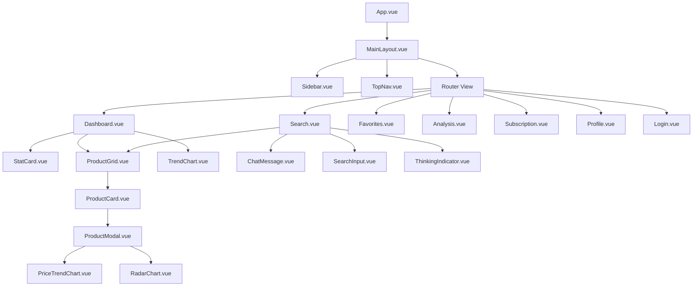

# Design Document: Frontend UI Refactor

## Overview

This design document outlines the technical architecture and implementation approach for refactoring the FlashSell frontend to match the UI design in `docs/3.UI-Design/index.html`. The refactoring involves implementing a modern glassmorphism design system with Vue 3 Composition API, TypeScript, and Tailwind CSS 4.x.

### Key Design Goals

1. **Visual Fidelity**: Match the UI design exactly, including glassmorphism effects, aurora backgrounds, and animations
2. **Component Reusability**: Create a modular component library that can be easily maintained and extended
3. **Performance**: Optimize rendering and minimize bundle size
4. **Type Safety**: Leverage TypeScript for robust type checking
5. **API Integration**: Seamless integration with existing backend APIs

### Technology Stack

- **Framework**: Vue 3.5 with Composition API
- **Language**: TypeScript 5.8
- **Styling**: Tailwind CSS 4.x with custom CSS variables
- **State Management**: Pinia
- **Routing**: Vue Router 4.x
- **HTTP Client**: Axios with interceptors
- **Charts**: ECharts 6.x with vue-echarts
- **Build Tool**: Vite 6.x

## Architecture

### Application Structure

```
flashsell-web/src/
├── api/                    # API client modules
│   ├── request.ts          # Axios instance with interceptors
│   ├── auth.ts             # Authentication API
│   ├── search.ts           # Search API
│   ├── dashboard.ts        # Dashboard API
│   ├── favorites.ts        # Favorites API
│   ├── market.ts           # Market analysis API
│   ├── product.ts          # Product API
│   ├── subscription.ts     # Subscription API
│   └── user.ts             # User API
├── assets/                 # Static assets
│   └── icons/              # SVG icons
├── components/             # Reusable components
│   ├── common/             # Generic UI components
│   │   ├── GlassCard.vue
│   │   ├── Button.vue
│   │   ├── Input.vue
│   │   ├── Modal.vue
│   │   ├── Badge.vue
│   │   ├── Skeleton.vue
│   │   └── Toast.vue
│   ├── layout/             # Layout components
│   │   ├── Sidebar.vue
│   │   ├── TopNav.vue
│   │   └── MainLayout.vue
│   ├── product/            # Product-related components
│   │   ├── ProductCard.vue
│   │   ├── ProductModal.vue
│   │   ├── ProductGrid.vue
│   │   └── PlatformBadge.vue
│   ├── charts/             # Chart components
│   │   ├── PriceTrendChart.vue
│   │   ├── RadarChart.vue
│   │   └── TrendChart.vue
│   └── search/             # Search-related components
│       ├── ChatMessage.vue
│       ├── SearchInput.vue
│       ├── SuggestionChip.vue
│       └── ThinkingIndicator.vue
├── composables/            # Vue composables (hooks)
│   ├── useTheme.ts         # Theme management
│   ├── useI18n.ts          # Internationalization
│   ├── useToast.ts         # Toast notifications
│   ├── useLoading.ts       # Loading state management
│   └── useConfirm.ts       # Confirmation dialogs
├── layouts/                # Page layouts
│   └── MainLayout.vue
├── router/                 # Vue Router configuration
│   └── index.ts
├── stores/                 # Pinia stores
│   ├── user.ts             # User state
│   ├── theme.ts            # Theme state
│   ├── search.ts           # Search state
│   ├── favorites.ts        # Favorites state
│   └── i18n.ts             # Language state
├── styles/                 # Global styles
│   ├── variables.css       # CSS custom properties
│   ├── glassmorphism.css   # Glass effect styles
│   ├── animations.css      # Animation keyframes
│   └── theme.css           # Theme-specific styles
├── types/                  # TypeScript type definitions
│   ├── api.ts              # API response types
│   ├── product.ts          # Product types
│   ├── user.ts             # User types
│   └── market.ts           # Market types
├── utils/                  # Utility functions
│   ├── format.ts           # Formatting utilities
│   ├── storage.ts          # LocalStorage utilities
│   └── validators.ts       # Input validators
├── views/                  # Page components
│   ├── Dashboard.vue
│   ├── Search.vue
│   ├── Favorites.vue
│   ├── Analysis.vue
│   ├── Subscription.vue
│   ├── Profile.vue
│   ├── Login.vue
│   └── NotFound.vue
├── App.vue                 # Root component
├── main.ts                 # Application entry
└── style.css               # Global CSS imports
```

### Component Hierarchy



## Components and Interfaces

### Theme System

The theme system uses CSS custom properties for dynamic theming:

```typescript
// composables/useTheme.ts
interface ThemeConfig {
  mode: 'dark' | 'light'
  colors: {
    primary: string
    secondary: string
    bgDark: string
    bgCard: string
    textPrimary: string
    textSecondary: string
    textMuted: string
    border: string
    success: string
    danger: string
    warning: string
  }
  glass: {
    bgDark: string
    bgLight: string
    borderDark: string
    borderLight: string
  }
}

interface UseThemeReturn {
  theme: Ref<'dark' | 'light'>
  isDark: ComputedRef<boolean>
  toggleTheme: () => void
  setTheme: (mode: 'dark' | 'light') => void
}
```

### Sidebar Component

```typescript
// components/layout/Sidebar.vue
interface SidebarProps {
  collapsed: boolean
  mobileOpen: boolean
}

interface NavItem {
  id: string
  label: string
  icon: string
  route: string
  badge?: number
}

interface SidebarEmits {
  (e: 'toggle'): void
  (e: 'mobile-close'): void
  (e: 'logout'): void
}
```

### Product Card Component

```typescript
// components/product/ProductCard.vue
interface ProductCardProps {
  product: Product
  isFavorite: boolean
  showPlatformBadges?: boolean
}

interface Product {
  id: number
  title: string
  description?: string
  price: number
  originalPrice?: number
  currency: string
  imageUrl?: string
  platforms: Platform[]
  badge?: 'hot' | 'trending' | 'new'
  rating?: number
  salesCount?: number
  aiScore?: number
}

interface Platform {
  name: 'amazon' | 'ebay' | 'aliexpress' | 'tiktok'
  price: number
  url: string
}

interface ProductCardEmits {
  (e: 'click', product: Product): void
  (e: 'favorite', product: Product): void
}
```

### Product Modal Component

```typescript
// components/product/ProductModal.vue
interface ProductModalProps {
  show: boolean
  product: ProductDetail | null
  loading: boolean
}

interface ProductDetail extends Product {
  priceHistory: PricePoint[]
  competitiveAnalysis: CompetitiveMetrics
  aiAnalysis: AIAnalysis
  platformComparison: PlatformData[]
}

interface PricePoint {
  date: string
  price: number
}

interface CompetitiveMetrics {
  priceCompetitiveness: number
  marketDemand: number
  profitPotential: number
  competitionLevel: number
  trendScore: number
}

interface AIAnalysis {
  summary: string
  confidence: number
  recommendation: 'buy' | 'watch' | 'skip'
  highlights: string[]
}

interface PlatformData {
  platform: string
  price: number
  rating: number
  reviews: number
  shipping: string
  availability: string
}
```

### Search Chat Interface

```typescript
// components/search/ChatMessage.vue
interface ChatMessageProps {
  type: 'user' | 'ai'
  content: string
  timestamp?: Date
  products?: Product[]
  isTyping?: boolean
}

// components/search/SearchInput.vue
interface SearchInputProps {
  modelValue: string
  placeholder?: string
  disabled?: boolean
  maxLength?: number
}

interface SearchInputEmits {
  (e: 'update:modelValue', value: string): void
  (e: 'submit', value: string): void
  (e: 'image-upload', file: File): void
}

// components/search/ThinkingIndicator.vue
interface ThinkingStep {
  id: string
  label: string
  status: 'pending' | 'active' | 'completed'
}
```

### API Client Interfaces

```typescript
// types/api.ts
interface ApiResponse<T> {
  code: number
  message: string
  data: T
}

interface PaginatedResponse<T> {
  items: T[]
  total: number
  page: number
  pageSize: number
  hasMore: boolean
}

// api/search.ts
interface SearchReq {
  query: string
  categoryId?: number
  priceMin?: number
  priceMax?: number
  platforms?: string[]
  page?: number
  pageSize?: number
}

interface SearchRes {
  products: Product[]
  total: number
  aiSummary?: string
  suggestions?: string[]
}

// api/dashboard.ts
interface DashboardStats {
  todayNewProducts: number
  potentialHotProducts: number
  favoritesCount: number
  aiAccuracy: number
  changes: {
    newProducts: number
    hotProducts: number
    favorites: number
    accuracy: number
  }
}

interface DashboardRes {
  stats: DashboardStats
  aiRecommendations: Product[]
  trendingCategories: Category[]
  recentActivity: Activity[]
}
```

### Pinia Store Interfaces

```typescript
// stores/user.ts
interface UserState {
  user: User | null
  token: string | null
  refreshToken: string | null
  isLoggedIn: boolean
}

interface UserActions {
  login(phone: string, code: string): Promise<void>
  register(phone: string, code: string): Promise<void>
  logout(): void
  refreshAuth(): Promise<void>
  updateProfile(data: Partial<User>): Promise<void>
}

// stores/theme.ts
interface ThemeState {
  mode: 'dark' | 'light'
}

interface ThemeActions {
  toggle(): void
  setMode(mode: 'dark' | 'light'): void
  initFromStorage(): void
}

// stores/search.ts
interface SearchState {
  query: string
  results: Product[]
  total: number
  isLoading: boolean
  error: string | null
  aiSummary: string | null
  filters: SearchFilters
  history: string[]
  chatMessages: ChatMessage[]
}

interface SearchFilters {
  categoryId?: number
  priceMin?: number
  priceMax?: number
  platforms: string[]
}

// stores/i18n.ts
interface I18nState {
  locale: 'zh' | 'en'
  messages: Record<string, Record<string, string>>
}
```

## Data Models

### CSS Variables Structure

```css
/* styles/variables.css */
:root {
  /* Primary Colors */
  --primary: #F97316;
  --primary-hover: #EA580C;
  --secondary: #3B82F6;
  
  /* Background Colors - Dark Mode */
  --bg-dark: #0F172A;
  --bg-card: #1E293B;
  --bg-card-hover: #334155;
  
  /* Text Colors */
  --text-primary: #F8FAFC;
  --text-secondary: #94A3B8;
  --text-muted: #64748B;
  
  /* Border Colors */
  --border: #334155;
  --border-subtle: rgba(51, 65, 85, 0.5);
  
  /* Status Colors */
  --success: #10B981;
  --danger: #EF4444;
  --warning: #F59E0B;
  
  /* Glassmorphism */
  --glass-bg-dark: rgba(30, 41, 59, 0.7);
  --glass-bg-light: rgba(255, 255, 255, 0.75);
  --glass-border-dark: rgba(51, 65, 85, 0.5);
  --glass-border-light: rgba(203, 213, 225, 0.9);
  --glass-blur: 12px;
  
  /* Shadows */
  --shadow-sm: 0 1px 2px rgba(0, 0, 0, 0.05);
  --shadow-md: 0 4px 6px rgba(0, 0, 0, 0.1);
  --shadow-lg: 0 10px 15px rgba(0, 0, 0, 0.1);
  --shadow-glow-orange: 0 0 20px rgba(249, 115, 22, 0.2);
  --shadow-glow-blue: 0 0 20px rgba(59, 130, 246, 0.2);
  
  /* Transitions */
  --transition-fast: 0.15s ease;
  --transition-normal: 0.2s ease;
  --transition-slow: 0.3s ease;
  
  /* Border Radius */
  --radius-sm: 8px;
  --radius-md: 12px;
  --radius-lg: 16px;
  --radius-xl: 20px;
  --radius-full: 9999px;
  
  /* Spacing */
  --sidebar-width: 260px;
  --sidebar-collapsed-width: 72px;
}

/* Light Mode Overrides */
html.light {
  --bg-dark: #F8FAFC;
  --bg-card: #FFFFFF;
  --bg-card-hover: #F1F5F9;
  --text-primary: #0F172A;
  --text-secondary: #475569;
  --text-muted: #64748B;
  --border: #E2E8F0;
  --border-subtle: rgba(203, 213, 225, 0.9);
}
```

### Internationalization Messages Structure

```typescript
// locales/zh.ts
const zhMessages = {
  nav: {
    main: '主导航',
    dashboard: '仪表盘',
    search: 'AI 搜索',
    favorites: '收藏夹',
    analysis: '市场分析',
    account: '账户',
    subscription: '订阅',
    profile: '个人资料'
  },
  dashboard: {
    welcome: '欢迎回来',
    todayNewProducts: '今日新品发现',
    potentialHotProducts: '潜力爆品推荐',
    favoritesCount: '收藏产品数',
    aiAccuracy: 'AI推荐准确率',
    aiRecommendations: 'AI爆品推荐',
    viewAll: '查看全部'
  },
  search: {
    title: 'AI 智能选品',
    subtitle: '告诉我你想找什么产品，我来帮你分析',
    placeholder: '描述你想找的产品...',
    suggestions: {
      hotProducts: '热门爆品',
      trending: '趋势上升',
      highProfit: '高利润'
    }
  },
  product: {
    price: '价格',
    sales: '销量',
    rating: '评分',
    addToFavorites: '加入收藏',
    removeFromFavorites: '取消收藏',
    viewOnPlatform: '查看原链接'
  },
  common: {
    loading: '加载中...',
    error: '出错了',
    retry: '重试',
    cancel: '取消',
    confirm: '确认',
    save: '保存',
    delete: '删除'
  }
}

// locales/en.ts
const enMessages = {
  nav: {
    main: 'Main Navigation',
    dashboard: 'Dashboard',
    search: 'AI Search',
    favorites: 'Favorites',
    analysis: 'Market Analysis',
    account: 'Account',
    subscription: 'Subscription',
    profile: 'Profile'
  },
  // ... similar structure
}
```

### Route Configuration

```typescript
// router/index.ts
const routes: RouteRecordRaw[] = [
  {
    path: '/',
    component: MainLayout,
    children: [
      {
        path: '',
        name: 'Dashboard',
        component: () => import('@/views/Dashboard.vue'),
        meta: { requiresAuth: false }
      },
      {
        path: 'search',
        name: 'Search',
        component: () => import('@/views/Search.vue'),
        meta: { requiresAuth: false }
      },
      {
        path: 'favorites',
        name: 'Favorites',
        component: () => import('@/views/Favorites.vue'),
        meta: { requiresAuth: true }
      },
      {
        path: 'analysis',
        name: 'Analysis',
        component: () => import('@/views/Analysis.vue'),
        meta: { requiresAuth: false }
      },
      {
        path: 'subscription',
        name: 'Subscription',
        component: () => import('@/views/Subscription.vue'),
        meta: { requiresAuth: true }
      },
      {
        path: 'profile',
        name: 'Profile',
        component: () => import('@/views/Profile.vue'),
        meta: { requiresAuth: true }
      }
    ]
  },
  {
    path: '/login',
    name: 'Login',
    component: () => import('@/views/Login.vue'),
    meta: { requiresAuth: false, hideLayout: true }
  },
  {
    path: '/:pathMatch(.*)*',
    name: 'NotFound',
    component: () => import('@/views/NotFound.vue')
  }
]
```


## Correctness Properties

*A property is a characteristic or behavior that should hold true across all valid executions of a system—essentially, a formal statement about what the system should do. Properties serve as the bridge between human-readable specifications and machine-verifiable correctness guarantees.*

Based on the prework analysis, the following properties have been identified for property-based testing. Properties have been consolidated to eliminate redundancy.

### Property 1: Theme Toggle Round-Trip

*For any* initial theme state (dark or light), clicking the theme toggle button should result in the opposite theme being applied, and clicking again should restore the original theme.

**Validates: Requirements 1.3, 1.4, 1.5**

### Property 2: Theme Persistence

*For any* theme selection made by the user, storing the theme in localStorage and then reloading the application should restore the same theme.

**Validates: Requirements 1.4, 1.5**

### Property 3: Phone Number Validation

*For any* string input, the phone validation function should return true only for valid Chinese mobile numbers matching the pattern `1[3-9]\d{9}`, and false for all other strings.

**Validates: Requirements 4.4**

### Property 4: Login Mode Toggle

*For any* current login mode (login or register), clicking the mode switch should toggle to the opposite mode, and the form should update accordingly.

**Validates: Requirements 4.5**

### Property 5: Sidebar Collapse State

*For any* sidebar state (expanded or collapsed), toggling the collapse should change the sidebar width and the main content area should adjust its margin accordingly.

**Validates: Requirements 3.2, 3.3**

### Property 6: Active Navigation Highlighting

*For any* route in the application, the corresponding navigation item in the sidebar should have the active class applied, and no other navigation items should be active.

**Validates: Requirements 3.4**

### Property 7: User Authentication State Display

*For any* authentication state (logged in or logged out), the sidebar should display user profile information only when logged in, and the logout button should only be visible when authenticated.

**Validates: Requirements 3.6, 3.7**

### Property 8: Search Query Display

*For any* non-empty search query submitted by the user, the query should appear as a user message bubble in the chat interface.

**Validates: Requirements 6.4**

### Property 9: Search Loading State

*For any* search request in progress, the AI thinking indicator should be visible, and when the request completes, the indicator should be hidden and results should be displayed.

**Validates: Requirements 6.5, 6.6**

### Property 10: Favorites List Consistency

*For any* product added to or removed from favorites, the favorites list should immediately reflect the change, and the total count should be updated accordingly.

**Validates: Requirements 7.1, 7.2, 7.5, 7.6**

### Property 11: Empty State Display

*For any* favorites list with zero items, the empty state component should be displayed instead of the product grid.

**Validates: Requirements 7.3**

### Property 12: Product Modal Display

*For any* product object, when the product modal is opened, it should display the product's title, description, price, and platform comparison data correctly.

**Validates: Requirements 9.1, 9.2, 9.5**

### Property 13: Modal Close Behavior

*For any* open modal, clicking the close button or clicking outside the modal should close it and return to the previous view.

**Validates: Requirements 9.7**

### Property 14: Language Persistence

*For any* language selection (zh or en), storing the preference in localStorage and reloading should restore the same language.

**Validates: Requirements 13.4**

### Property 15: Language Switch Reactivity

*For any* language change, all translatable text in the current view should update immediately to reflect the new language.

**Validates: Requirements 13.5**

### Property 16: Loading State Display

*For any* API request in progress, the appropriate loading indicator (skeleton or spinner) should be displayed, and when the request completes, the loading indicator should be replaced with the actual content.

**Validates: Requirements 14.1**

### Property 17: Error State Display

*For any* failed API request, an error message should be displayed with a retry option, and clicking retry should re-attempt the request.

**Validates: Requirements 14.2, 14.3**

### Property 18: API Retry Logic

*For any* failed API request due to network or server error, the system should automatically retry up to 2 times before displaying an error to the user.

**Validates: Requirements 14.4**

### Property 19: Product Card Data Display

*For any* product object, the product card should display the title (truncated to 2 lines if necessary), price with currency symbol, and platform badges for all associated platforms.

**Validates: Requirements 15.1, 15.2, 15.3, 15.4**

### Property 20: Product Card Badge Display

*For any* product with a badge property (hot, trending, or new), the corresponding badge should be displayed on the product card. Products without a badge property should not display any badge.

**Validates: Requirements 15.5**

### Property 21: Favorite Button State

*For any* product card, the favorite button should reflect the current favorite state (filled heart if favorited, outline if not), and clicking the button should toggle the state.

**Validates: Requirements 15.6**

### Property 22: Product Card Click Handler

*For any* product card click, the product detail modal should open with the correct product data loaded.

**Validates: Requirements 5.6, 15.8**

### Property 23: Subscription Plan Highlighting

*For any* user with an active subscription, the subscription page should highlight their current plan and show appropriate upgrade/downgrade options.

**Validates: Requirements 10.2**

### Property 24: Profile Data Display

*For any* authenticated user, the profile page should display their user information (name, phone) and allow editing the nickname.

**Validates: Requirements 11.1, 11.2**

### Property 25: Dashboard Welcome Message

*For any* authenticated user, the dashboard should display a personalized welcome message with the user's name. For unauthenticated users, a generic welcome message should be shown.

**Validates: Requirements 5.1**

## Error Handling

### API Error Handling Strategy

```typescript
// Error types and handling
enum ErrorType {
  NETWORK = 'NETWORK',      // No network connection
  TIMEOUT = 'TIMEOUT',      // Request timeout
  SERVER = 'SERVER',        // 5xx server errors
  BUSINESS = 'BUSINESS',    // Business logic errors (4xx)
  AUTH = 'AUTH'             // Authentication errors (401)
}

// Error handling flow
1. Network Error → Display "网络连接失败" → Offer retry
2. Timeout Error → Display "请求超时" → Auto-retry (max 2) → Offer manual retry
3. Server Error → Display "服务器错误" → Auto-retry (max 2) → Offer manual retry
4. Business Error → Display specific error message from API
5. Auth Error → Clear tokens → Redirect to login
```

### Component-Level Error Handling

```typescript
// Each data-fetching component should handle:
interface ErrorState {
  hasError: boolean
  errorMessage: string
  errorType: ErrorType
  canRetry: boolean
}

// Error boundary pattern for Vue
const ErrorBoundary = defineComponent({
  setup(props, { slots }) {
    const error = ref<Error | null>(null)
    
    onErrorCaptured((err) => {
      error.value = err
      return false // Prevent propagation
    })
    
    return () => error.value 
      ? h(ErrorDisplay, { error: error.value })
      : slots.default?.()
  }
})
```

### Form Validation Errors

```typescript
// Validation error display pattern
interface ValidationError {
  field: string
  message: string
}

// Phone validation
function validatePhone(phone: string): ValidationError | null {
  if (!phone) return { field: 'phone', message: '请输入手机号' }
  if (!/^1[3-9]\d{9}$/.test(phone)) return { field: 'phone', message: '请输入正确的手机号' }
  return null
}

// Verification code validation
function validateCode(code: string): ValidationError | null {
  if (!code) return { field: 'code', message: '请输入验证码' }
  if (code.length !== 6) return { field: 'code', message: '请输入6位验证码' }
  return null
}
```

### Toast Notification System

```typescript
// Toast types for different scenarios
type ToastType = 'success' | 'error' | 'warning' | 'info'

interface Toast {
  id: string
  type: ToastType
  message: string
  duration: number
  dismissible: boolean
}

// Usage patterns
toast.success('操作成功')
toast.error('操作失败，请重试')
toast.warning('网络不稳定')
toast.info('新版本可用')
```

## Testing Strategy

### Dual Testing Approach

This project uses both unit tests and property-based tests for comprehensive coverage:

- **Unit tests**: Verify specific examples, edge cases, and error conditions
- **Property tests**: Verify universal properties across all valid inputs

### Testing Framework

- **Unit Testing**: Vitest
- **Property-Based Testing**: fast-check
- **Component Testing**: @vue/test-utils
- **E2E Testing**: Playwright (optional)

### Property-Based Testing Configuration

Each property test must:
1. Run minimum 100 iterations
2. Reference the design document property number
3. Use the tag format: **Feature: frontend-ui-refactor, Property {number}: {property_text}**

```typescript
// Example property test structure
import { describe, it, expect } from 'vitest'
import fc from 'fast-check'

describe('Theme System', () => {
  // Feature: frontend-ui-refactor, Property 1: Theme Toggle Round-Trip
  it('should toggle theme correctly for any initial state', () => {
    fc.assert(
      fc.property(
        fc.constantFrom('dark', 'light'),
        (initialTheme) => {
          const { theme, toggleTheme } = useTheme()
          theme.value = initialTheme
          
          toggleTheme()
          const afterFirstToggle = theme.value
          
          toggleTheme()
          const afterSecondToggle = theme.value
          
          expect(afterFirstToggle).not.toBe(initialTheme)
          expect(afterSecondToggle).toBe(initialTheme)
        }
      ),
      { numRuns: 100 }
    )
  })
})
```

### Test File Organization

```
flashsell-web/
├── src/
│   └── ...
├── tests/
│   ├── unit/
│   │   ├── composables/
│   │   │   ├── useTheme.spec.ts
│   │   │   ├── useI18n.spec.ts
│   │   │   └── useToast.spec.ts
│   │   ├── components/
│   │   │   ├── ProductCard.spec.ts
│   │   │   ├── Sidebar.spec.ts
│   │   │   └── SearchInput.spec.ts
│   │   ├── stores/
│   │   │   ├── user.spec.ts
│   │   │   ├── search.spec.ts
│   │   │   └── favorites.spec.ts
│   │   └── utils/
│   │       ├── validators.spec.ts
│   │       └── format.spec.ts
│   ├── property/
│   │   ├── theme.property.spec.ts
│   │   ├── validation.property.spec.ts
│   │   ├── sidebar.property.spec.ts
│   │   ├── search.property.spec.ts
│   │   ├── favorites.property.spec.ts
│   │   ├── i18n.property.spec.ts
│   │   └── productCard.property.spec.ts
│   └── e2e/
│       ├── login.spec.ts
│       ├── search.spec.ts
│       └── favorites.spec.ts
└── vitest.config.ts
```

### Unit Test Examples

```typescript
// Unit test for phone validation
describe('validatePhone', () => {
  it('should accept valid Chinese mobile numbers', () => {
    expect(validatePhone('13812345678')).toBeNull()
    expect(validatePhone('15912345678')).toBeNull()
    expect(validatePhone('18812345678')).toBeNull()
  })

  it('should reject invalid phone numbers', () => {
    expect(validatePhone('')).not.toBeNull()
    expect(validatePhone('12345678901')).not.toBeNull() // starts with 1 but not 13-19
    expect(validatePhone('1381234567')).not.toBeNull()  // too short
    expect(validatePhone('138123456789')).not.toBeNull() // too long
  })
})

// Unit test for product card rendering
describe('ProductCard', () => {
  it('should display product title', () => {
    const wrapper = mount(ProductCard, {
      props: {
        product: { id: 1, title: 'Test Product', price: 99.99, currency: 'USD', platforms: [] },
        isFavorite: false
      }
    })
    expect(wrapper.text()).toContain('Test Product')
  })

  it('should show favorite button as filled when favorited', () => {
    const wrapper = mount(ProductCard, {
      props: {
        product: { id: 1, title: 'Test', price: 99.99, currency: 'USD', platforms: [] },
        isFavorite: true
      }
    })
    expect(wrapper.find('.favorite-btn').classes()).toContain('favorited')
  })
})
```

### Property Test Examples

```typescript
// Property test for phone validation
// Feature: frontend-ui-refactor, Property 3: Phone Number Validation
describe('Phone Validation Property', () => {
  it('should correctly validate any string as phone number', () => {
    fc.assert(
      fc.property(fc.string(), (input) => {
        const result = validatePhone(input)
        const isValidFormat = /^1[3-9]\d{9}$/.test(input)
        
        if (isValidFormat) {
          expect(result).toBeNull()
        } else {
          expect(result).not.toBeNull()
        }
      }),
      { numRuns: 100 }
    )
  })
})

// Property test for favorites consistency
// Feature: frontend-ui-refactor, Property 10: Favorites List Consistency
describe('Favorites Consistency Property', () => {
  it('should maintain consistent state after add/remove operations', () => {
    fc.assert(
      fc.property(
        fc.array(fc.record({ id: fc.nat(), title: fc.string() }), { minLength: 1, maxLength: 10 }),
        fc.nat(),
        (products, targetIndex) => {
          const store = useFavoritesStore()
          store.$reset()
          
          const product = products[targetIndex % products.length]
          
          // Add to favorites
          store.addFavorite(product.id)
          expect(store.isFavorite(product.id)).toBe(true)
          expect(store.count).toBe(1)
          
          // Remove from favorites
          store.removeFavorite(product.id)
          expect(store.isFavorite(product.id)).toBe(false)
          expect(store.count).toBe(0)
        }
      ),
      { numRuns: 100 }
    )
  })
})
```

### Test Coverage Goals

| Category | Target Coverage |
|----------|----------------|
| Composables | 90% |
| Stores | 85% |
| Utils | 95% |
| Components | 75% |
| API Client | 80% |

### Running Tests

```bash
# Run all tests
npm run test

# Run unit tests only
npm run test:unit

# Run property tests only
npm run test:property

# Run with coverage
npm run test:coverage

# Run in watch mode
npm run test:watch
```
